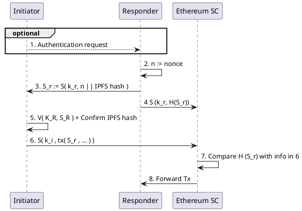

# Handover

## Use case description

Bitcoin transactions rely on source authentication, i.e., a transaction is valid when a sender signs a transaction. Source authentication can be used when transactions only represent a transfer of a personally owned assets. For transactions that represent a transfer of both assets and liabilities, or for transactions where asset transfers involve assets that the sender does not personally own, we often require multi-authentication.

## Multi-source authentication

Multi-signature based protocols are useful when asset transfers involve jointly owned assets. Authentication is here given when a predefined set of keys are combined. For instance,

1. Pick a secret $k \leftarrow K$
2. Pick another random element $k_{1} \leftarrow K$
3. Give Alice $ k \oplus k_{1} $
4. Give Bob $k_{1}$
5. $ S( k_{1} \oplus (k \oplus k_{1}) , m) $

Alice cannot alone use $S()$ because she only has knowledge of $ k \oplus k_{1} $. Relatedly, Bob cannot use $S()$ because he only has knowledge of $k_{1}$. Only together can they can sign $m$.

## Mutual authentication

Transactions that simultaneously handover assets and liabilities can make use of mutual authentication that requires both the source and the recipient to sign a message. Here, we assume that the set of all transacting actors is not known at the start. One possible authentication protocol is as follows:

Here, the initiator and the responder both verify a signature. The responder generates a nonce, $n$, and sends $ n\|H_{IPFS} $ to the initiator. Note that both the initiator and the responder can generate this link since they know what objects are part of the transaction. As such, either party can resolve $H_{IPFS}$.

Next, the initiator signs the IPFS link, $ S_{i} := S( k_{i} , n\|H_{IPFS}) $, and sends $S_{i}$ to the responder. The responder can now verify the initator using $ V( K_{i} , S_{i}) $ and be sure that the initiator has signed of on the intent to hand over $H_{IPFS}$.

The responder then signs the handover intent, $ S_{r} := S( k_{r} , S_{i}) $, and sends $S_{r}$ to the initiator. The initiator can now create a multi-entity authenticated Ethereum transaction as follows: $ S( k_{i} , (S_{r}, S_{i},...) ) $. As that transaction contains $ \{K_i, K_r\}$, anyone can verify $S_r$ and $S_i$. The handover referencing $H_{IPFS}$ is now multi-entity authenticated and should be considered valid.

Note that the nonce is only there to uniquely identify the handover intent. Exactly how the nonce should be designed and what it should represent is outside the scope of this text.