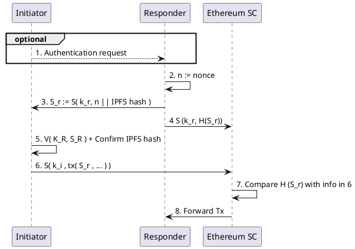
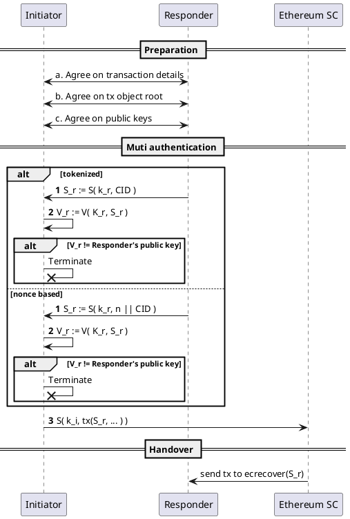

# Handover

## Use case description

Bitcoin transactions rely on source authentication, i.e., a transaction is valid when a sender signs a transaction. Source authentication can be used when transactions only represent a transfer of a personally owned assets. For transactions that represent a transfer of both assets and liabilities, or for transactions where asset transfers involve assets that the sender does not personally own, we often require multi-authentication.

## Multi-source authentication

Multi-signature based protocols are useful when asset transfers involve jointly owned assets. Authentication is here given when a predefined set of keys are combined. For instance,

1. Pick a secret $k \leftarrow K$
2. Pick another random element $k_{1} \leftarrow K$
3. Give Alice $ k \oplus k_{1} $
4. Give Bob $k_{1}$
5. $ S( k_{1} \oplus (k \oplus k_{1}) , m) $

Alice cannot alone use $S()$ because she only has knowledge of $ k \oplus k_{1} $. Relatedly, Bob cannot use $S()$ because he only has knowledge of $k_{1}$. Only together can they can sign $m$.

## Mutual authentication

### General protocol

Transactions that simultaneously handover assets and liabilities can make use of mutual authentication that requires both the source and the recipient to sign a message. Here, we assume that the set of all transacting actors is not known at the start. One possible authentication protocol is as follows:



Here, the initiator and the responder both verify a signature. The responder generates a nonce, $n$, and sends $ n\|H_{IPFS} $ to the initiator. Note that both the initiator and the responder can generate this link since they know what objects are part of the transaction. As such, either party can resolve $H_{IPFS}$.

Next, the initiator signs the IPFS link, $ S_{i} := S( k_{i} , n\|H_{IPFS}) $, and sends $S_{i}$ to the responder. The responder can now verify the initator using $ V( K_{i} , S_{i}) $ and be sure that the initiator has signed of on the intent to hand over $H_{IPFS}$.

The responder then signs the handover intent, $ S_{r} := S( k_{r} , S_{i}) $, and sends $S_{r}$ to the initiator. The initiator can now create a multi-entity authenticated Ethereum transaction as follows: $ S( k_{i} , (S_{r}, S_{i},...) ) $. As that transaction contains $ \{K_i, K_r\}$, anyone can verify $S_r$ and $S_i$. The handover referencing $H_{IPFS}$ is now multi-entity authenticated and should be considered valid.

Note that the nonce is only there to uniquely identify the handover intent. Exactly how the nonce should be designed and what it should represent is outside the scope of this text.

### Mutual auth without cert or UN / PW on Ethereum

Looking specifically at Ethereum, there are a few changes to the general protocol above. To understand these changes, we must first explain how Ethereum key generation works.

**Key and address generation for Ethereum**
Use a $RNG$ to generate a random 32 byte array (big-endian) in range $[1, secp256k1 - 1]$ where secp256k1 is a standard curve used for ECC. Note: an EC is defined by the equation $y^2=x^3 + ax + b$ with chosen $a$ and $b$; Ethereum uses the [secp256k1](https://hackernoon.com/what-is-the-math-behind-elliptic-curve-cryptography-f61b25253da3) curve.


```python
#!brew install sha3sum
#!pip install ecdsa
#!pip install pysha3
import subprocess
# private key generation
!openssl ecparam -name secp256k1 -genkey -noout | openssl ec -text -noout | tee Key

read EC key
Private-Key: (256 bit)
priv:
    25:78:d7:e4:df:39:30:14:f4:a2:1e:ef:65:29:d3:
    29:28:ba:d3:94:fd:7a:99:6d:38:70:b9:de:b2:04:
    c4:6e
pub: 
    04:46:5a:e2:5a:58:47:ee:73:db:9c:8d:4a:ed:b0:
    13:e1:86:33:5f:62:64:ee:e7:58:ea:e5:d5:ff:e6:
    ec:a9:21:bb:a3:96:89:50:c3:26:e7:c9:fe:6e:9b:
    8d:47:c0:00:28:8b:b6:46:3b:aa:8c:f5:c0:93:ae:
    81:cd:f2:23:6c
ASN1 OID: secp256k1

# Ethereum address generation
ETH_address = "0x" + subprocess.getoutput(
    "cat Key | grep pub -A 5 | tail -n +2 | tr -d '\n[:space:]:' | sed 's/^04//' | tee pub | keccak-256sum -x -l | tr -d ' -' | tail -c 41"
)
print(ETH_address)

0x127305ca1eafe3b56b624bba0ad6f1b603a793cd
```

We now have a key pair generated using the secp256k1 curve. We used the private key to generate the address.

**Signatures in ECC using PGP**

* Secure msg: $M_{s} := F(P_{initiator}, msg)$
* Secure and authenticated: $M_{sa} := F(P_{initiator}, F(p_{responder}, msg)$
* Secure, authenticated, and integrity preserving: $M_{sai} := H(M_{sa}) || M_{sa}$

GnuPG is able, since version 2.1, to use secp256k1 ECDSA, i.e., we can sign a msg with the same private key used to generate the Ethereum address.

**Verification in Ethereum smart contracts**
Ethereum smart contracts can run a function called `ecrecover()`. The function takes parameters `bytes32 hash, uint8 v, bytes32 r, bytes32 s`, and returns `address`. The function parameters correspond to ECDSA values of the signature: 
* r: first 32 bytes of signature; 
* s: second 32 bytes of signature; 
* v: final 1 byte of signature. 

Interestingly, it returns the address associated with the public key from an ECDSA.

As such, we can condition a token transaction by checking a signed msg, here a CID of the root object containing the transaction agreement. The Smart contract can verify the signature of a CID, and complete the transaction to the responder address it derives from `ecrecover()`.

**Multi authentication process**

