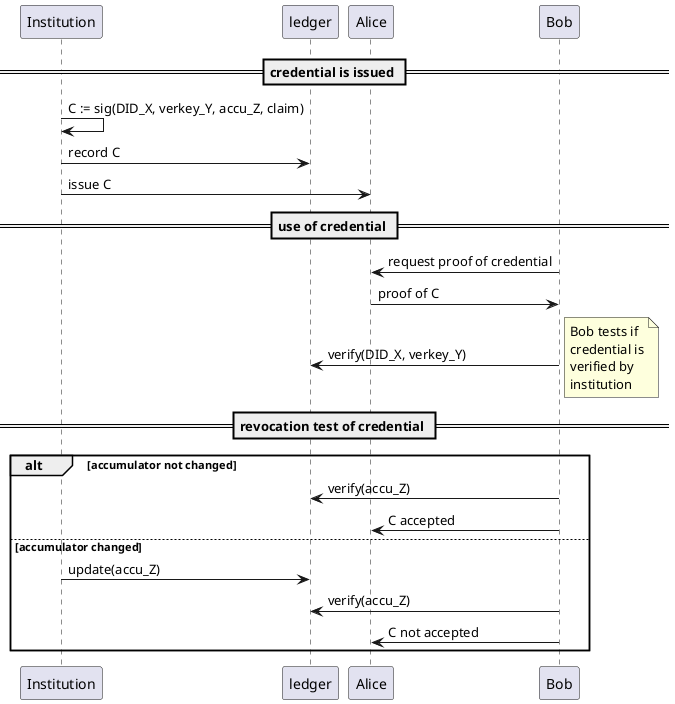
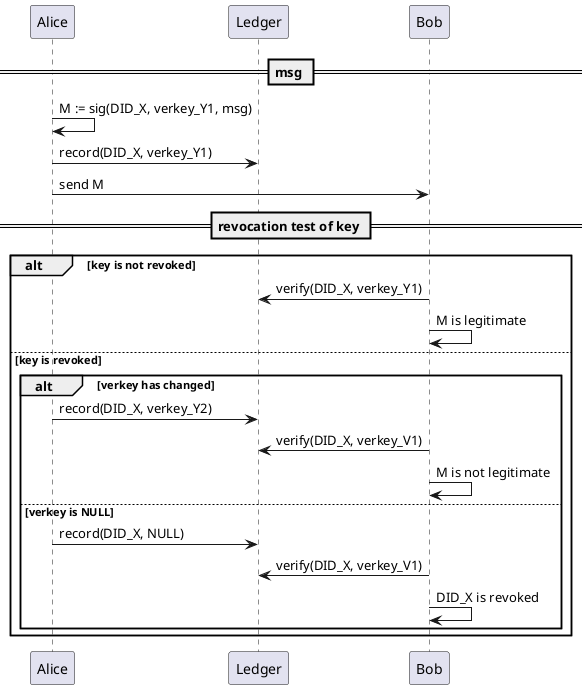
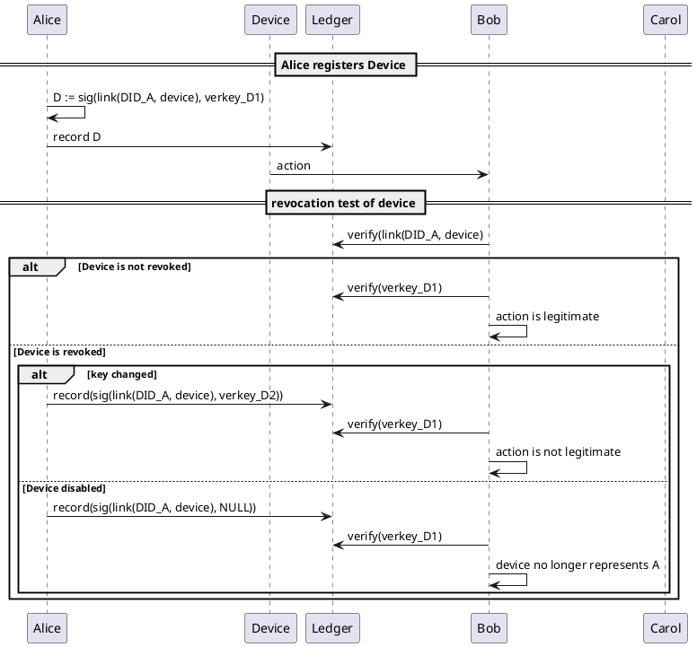

# IOTEX NKN youtube

[link](https://www.youtube.com/watch?v=ZGz7bUPj7-g)

* IOTEX works with trusted data an dtrusted devices

## Situation today

[Smart home market map](https://vinnter.se/wp-content/uploads/2019/08/1.-CB-Insights.png) with 60 companies listed by CBINSIGHTS.

* Many devices are entering homes.
* IoT devices are gateways between the physical world and the digital world.
   1. physical actions based on digital rights
   2. environmental readings to digital data processing pipelines
* Devices are minicomputers with processor, memory, storage, wireless module, sensors, and PSU, all held together by proprietary firmware.

### Data lifecycle of typical IoT device

* Data acquisition: sensors measure physical properties (location, climate, motion, touch, proximity, environmental readings) and convert these into digital data.
* On-device data processing: The raw data are processed by processors that perform basic data aggregation, validation, and analytics (optional and subject to available power).
* Communcations: Wireless module transmits the data to a gateway or Cloud via various connectivity methods
   1. Edge device -> Cloud through WiFi
   2. Edge device -> Gateway through LPWAN -> Cloud through WiFi
* Most IoT devices today come with complementary storage and processing that connects the device to a cloud.
   - Internet -Ethernet-> Modem (connects your home network and its devices to the internet) + Router (creates a WAN across connected devices) + Smart Hub (syncs low-power devices to your network via BLE Zwave Zigbee)
* 

# Project report LFIoT

Text

Aim is to decentralize as much as possible. Thus, we need:

- Distributed data structure
- Authenticated data structure
- Hash linked data structures

## Stack

Applications - DApps: verifiable and decentralized applications (e.g., Etherpad, Websites, uPort, Mediachain, [OpenBazaar](https://openbazaar.org/), Orbit)
Logic - Smart contracts and [multiparty computation](https://ethresear.ch/t/mpc-on-ethereum/311)
Transaction - blockchain protocols: secure consensus and transaction layer
Data structure - IPLD: secure data structures and merkle web
Networking - libp2p: secure, multiprotocol, high performance p2p networking

Data input oracles (this is where the box would come in)
Data analytics oracles (privacy preserving computation etc.)

## libp2p

libp2p handles the exchange, routing, and network aspects required to mode data around.

## IPLD

The **I**nter**P**lanetary **L**inked **D**ata 

IPLD is a common hash-chain format for distributed data structures.

- merkle-links: secure and immutable
- merkle-paths: /ipfs/QMabc...xyz/foo/bar/baz.ext
- canonical: hashing safe
- universal: nestable URIs
- serialization: CBOR, JSON, YML, XML, PB
- linked data JSON-LD, RDF compatible

IPLD secures data structures and is part of the Merkle web, a content addressable decentralized storage system. IPLD and IPNS is used to define the data by naming it and through merkledags.

IPLD is the think waist of the decentralized web stack.

```
> var ipld = requires('ipld')

>var obj1 = { "data": "Hello" }
>var obj1Hash = ipld.multihash(ipld.marshal(obj1))
> obj1Hash
QmUUuaDDWvRG23zyzBQVv43etRqmbGCRNhgZYu9qvZ88Bg

> var obj2 = { "data": "World\n" }
> var obj2Hash = ipld.multihash(ipld.marshal(obj2))
> obj2Hash
QmSVuc2kjbtCFQ9ur8fnyKUKvSyLZMTBVbZugJWChydAHV

> var obj3 = {
 "files": [
 { "/": "QmUUuaDDWvRG23zyzBQVv43etRqmbGCRNhgZYu9qvZ88Bg" },
 { "/": "QmSVuc2kjbtCFQ9ur8fnyKUKvSyLZMTBVbZugJWChydAHV" },
 ]
}
> var obj3Hash = ipld.multihash(ipld.marshal(obj3))
> obj3Hash
QmdhMzs1tkLYwC3jimzUABEt1xzkrokkanywe1y1QFcAhw

> ipfs.add(obj1)
> ipfs.add(obj2)
> ipfs.add(obj3)

> ipfs.resolve("QmdhMzs1tkLYwC3jimzUABEt1xzkrokkanywe1y1QFcAhw/files/0")
{ "data": "Hello " }

> ipfs.resolve("QmdhMzs1tkLYwC3jimzUABEt1xzkrokkanywe1y1QFcAhw/files/0/data")
"Hello "
```

`obj3` above points to `obj1` and `obj2`. 
Such a linked data approach allows for a VERY flexible system, one that can work for anything from DApps to serve as a flexible dynamic identity system.

1. Create a hierarchy of files
2. Process these files with obj# = ipld.multihash(ipld.marshal(obj#))
3. Upload all files to IPFS using ipfs.add(obj#)
4. Use the ipfs links in business logic


Content addressing through hashes can be used to connect data in distributed systems, IPLD is a way of representing hash-linked data.

IPLD can be used to resolve content such as Git repositories and blockchains.

It enables the creation of data structures that are universally addressable, facilitating resolving content across different protocols. IPLD achieves this using an interoperable data model where hash links are self-descriptive representations of various protocol formats. Content addressing in IPLD is done using Content Identifiers (CIDs). Using CIDs, it is possible to express a cryptographic hash in a self-describing, flexible, and interoperable way. CIDs rely on multiformats for flexible self-description. Multihash describes the hashes, multicodec the data content type, multibase the base encoding of the CID itself.

Using IPLD, actors need not agree on DID methods, DLT protocols, or computation frameworks (or whatever else can that relies on hashlinked data). 


### IPFS

IPFS is a hypermedia distribution protocol, i.e., a [transport protocol](https://en.wikipedia.org/wiki/Transport_layer). The IPFS stack allows applications to make use of the data that is defined on IPNS and IPLD.

IPFS is a content-addressed data retrieval system.

Example:

dns name: `/dns/example.com/foo/bar/baz.png`
key name: `/ipns/QmYJPtosPTfoC/foo/bar/baz.png`
cont addr: `ipfs:/ipfs/QmW98pJrc6FZ6/foo/bar/baz.png`

[npm on IPFS](https://github.com/ipfs-shipyard/npm-on-ipfs)
[package manager for IPFS](https://github.com/whyrusleeping/gx)

Content addressable and digitally signed permanent hash links. 

IPFS works well with linked merkle-trees

[IPFS CLI commands](https://docs.ipfs.io/reference/api/cli/)

### IPLD / IPFS as a general pattern for DID methods

[Source: IPLD as a gGeneral pattern for DID documents and verifiable claims](https://github.com/WebOfTrustInfo/rwot7-toronto/blob/master/final-documents/ipld-did.pdf)


## The setup

- Ubuntu Server 18.04 LTS
- Ganache (connected with metamask)
- Truffle Suite
- node.js
- Solidity
- IPLD
- JSON-LD
- [Open Geospatial Consortium](https://en.wikipedia.org/wiki/Open_Geospatial_Consortium)
- [Semantic Sensor Web](https://en.wikipedia.org/wiki/Semantic_Sensor_Web)
- [Sensor Grid](https://en.wikipedia.org/wiki/Sensor_grid)
- [Sensor Web](https://en.wikipedia.org/wiki/Sensor_web)
- [IPLD schemas](https://github.com/ipld/specs/tree/master/schemas)
- [SensorML 2.0](http://www.sensorml.com/sensorML-2.0/examples/index.html)
- [OGC](https://www.fierceelectronics.com/components/mature-sensor-communication-standards-for-internet-things)
- [multiformats](https://youtu.be/Bqs_LzBjQyk?t=996)

## Multiformats

Multiformats are self describing values that enable protocol agility, interoperability, and avoids lock ins. DIDs are an example.

Multiformats consist of the following:

 - [multihash](https://github.com/multiformats/multihash): cryptographic hashes
 - multiaddr: network addresses
 - multibase: base encodings
 - multicodec: serialization codecs
 - multistream: stream wire protocols
 - multikey: cryptogrpahic keys and artifacts

 ### Multihashes

 Multihashes allow you to seperate different hash digests from the same inputs. The same input will produce different hash digests depending on the cryptographic hash function used. The idea behind multihashes is to self-describe the values to distinguish between the hash functions used on the same input. 

 ```
    fn code  dig size  hash digest
    -------- --------- -----------------------------------
    00010001 000000100 11000010 11110110 10100010 11110001 
 ```

 The `fn code` tells you what cryptographic hash function we are working with. The `dig size` is the hash digest size.

 fn code examples [(full table available here)](https://github.com/multiformats/multicodec/blob/master/table.csv)

 - `12 - sha2-256`
 - `13 - sha2-512`
 - `16 - sha3-256`
 - `a0e402 - blake2b-256`

 # Revocation

 Use [one-way accumulators](https://en.wikipedia.org/wiki/Accumulator_(cryptography)) as a decentralized alternative to digital signatures.

 Accumulator is the answer to a math problem.

## Revocation of credentials

Institution, I, wants to issue credential, e.g., driver's license, to Alice.



## Revocation of key

Some sender, e.g., institution, Alice, IoT devices holds keys.
Recipient receives msg, purpotedly from sender.
As above, recipient checks if the verkey from sender with DID specified in msg.
Revocation of key is done by sender changing verkey value on ledger.
This can be used for key rotation.



## Revocation of entity

Alice wants to revoke IoT device.



Note that moving out from a home, is equivalent with revoking device and setting device verkey to NULL